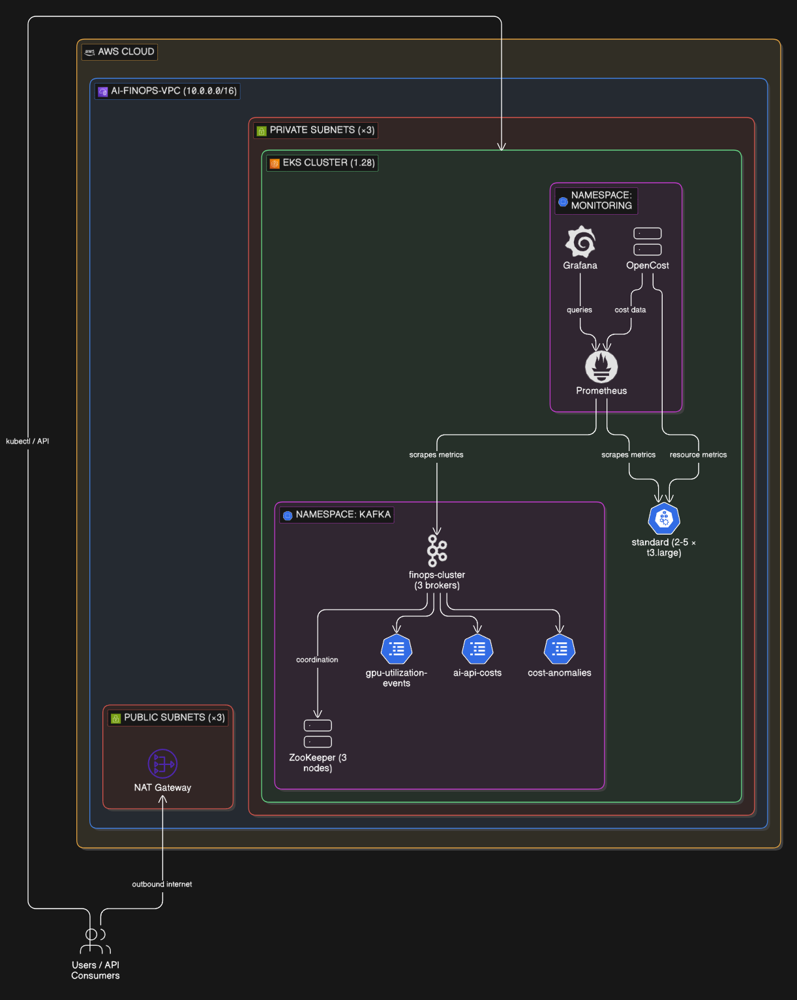

# AI FinOps Platform

A Kubernetes-native cost observability platform that streams GPU utilisation and AI API spend through Kafka into real-time Grafana dashboards — built for organisations running ML workloads at scale.

## Overview

AI infrastructure costs are notoriously opaque. GPU instances sit idle between training runs, API calls to hosted models accumulate silently, and platform teams lack the real-time visibility needed to act before budgets overrun. This project builds the observability layer that solves that problem.

The platform provisions an EKS cluster with Terraform, deploys a three-broker Strimzi Kafka cluster for high-throughput event streaming, and layers Prometheus, Grafana, and OpenCost on top for full-stack cost visibility. Three dedicated Kafka topics — GPU utilisation events, AI API costs, and cost anomalies — capture the data streams that feed the dashboards. The architecture separates cost data ingestion from visualisation, so each layer scales independently.

Everything is infrastructure-as-code and declarative. The VPC, EKS cluster, node groups, Kafka brokers, and topics are all version-controlled and reproducible — exactly how a platform team would operate this in production.

## Architecture

The platform runs inside a purpose-built VPC in eu-west-2 with three availability zones. EKS worker nodes sit in private subnets behind a NAT gateway, with no direct internet exposure. Strimzi manages the Kafka lifecycle inside the cluster's `kafka` namespace, handling broker coordination through a co-located three-node ZooKeeper ensemble. Prometheus scrapes metrics from both the Kafka brokers and the node group, Grafana queries Prometheus for dashboard visualisation, and OpenCost correlates resource consumption with actual cloud spend. Cost event data flows through Kafka topics with replication factor 3 and configurable partitioning (10 partitions for high-volume streams, 3 for anomaly alerts).

## Tech Stack

**Infrastructure**: AWS EKS, VPC (3 AZs, public/private subnets, NAT gateway), Terraform with community modules

**Data Streaming**: Strimzi Kafka (3 brokers), ZooKeeper (3 nodes), dedicated topics for GPU, API cost, and anomaly events

**Monitoring & FinOps**: Prometheus, Grafana, OpenCost

**Orchestration**: Kubernetes 1.28, EKS Managed Node Groups (t3.large)

## Key Decisions

- **Strimzi over self-managed Kafka**: Operating Kafka on Kubernetes is complex — Strimzi's operator pattern handles broker lifecycle, topic management, and rolling upgrades declaratively. This is how most teams run Kafka on EKS in production without dedicating an engineer to broker management.

- **Three separate Kafka topics over a single event stream**: GPU utilisation, API costs, and anomalies have different volume profiles and consumer patterns. Splitting them allows independent partition tuning (10 partitions for high-throughput GPU metrics, 3 for lower-volume anomaly alerts) and prevents a noisy stream from blocking cost anomaly processing.

- **Private subnets with single NAT gateway**: Worker nodes have no public IP exposure. A single NAT gateway keeps the demo cost-efficient while still demonstrating the production pattern of private compute with controlled egress.

- **OpenCost alongside Grafana**: Grafana visualises time-series metrics, but OpenCost maps resource consumption directly to Kubernetes cost allocation. Together they answer both "what's happening" and "what's it costing" — the two questions every FinOps team needs answered simultaneously.

## Screenshots

**EKS Cluster Overview** — AWS Console displaying the provisioned EKS cluster with complete node group configuration, showing 6 running compute nodes, 0 pods pending, and networking setup across multiple availability zones in eu-west-2.

**Kafka Topics Configuration** — kubectl output listing the three dedicated Kafka topics that power the platform: ai-api-costs (10 partitions), cost-anomalies (3 partitions), and gpu-utilization-events (10 partitions), all configured with replication factor 3 for high availability.

**Grafana Monitoring Dashboard** — Real-time Grafana dashboard with dark theme displaying multi-dimensional metrics including CPU and memory consumption trends, resource utilization graphs across time series data, and multiple panels monitoring the platform's performance characteristics.

**OpenCost Cost Allocation** — OpenCost UI showing cost breakdown with an interactive gauge chart visualizing daily cost allocation by namespace, including detailed tabular breakdown of per-namespace costs and resource consumption metrics.

**Kubernetes Pods Status** — kubectl output showing all running pods across the platform with full namespace visibility, displaying the complete Kafka cluster (brokers, ZooKeeper), Strimzi operators, Prometheus, Grafana, OpenCost, and monitoring components with their readiness status and uptime.

## Author

**Noah Frost**

- Website: [noahfrost.co.uk](https://noahfrost.co.uk)
- GitHub: [github.com/nfroze](https://github.com/nfroze)
- LinkedIn: [linkedin.com/in/nfroze](https://linkedin.com/in/nfroze)